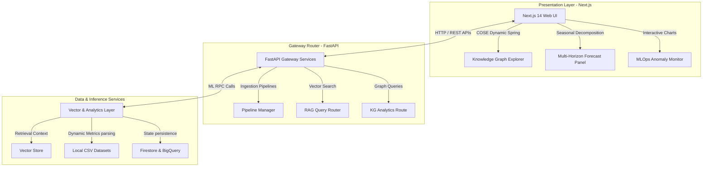

# 🌌 EnterpriseIQ — RAG-based Enterprise Data Into Actionable Intelligence

[](https://nextjs.org/)
[](https://fastapi.tiangolo.com/)
[](https://www.python.org/)
[](https://js.cytoscape.org/)
[](https://www.docker.com/)

EnterpriseIQ is a production-grade, full-stack AI platform designed to ingest massive raw corporate datasets (up to 25k+ records) and dynamically translate them into real-time business intelligence. Through a combination of **Dynamic Retrieval-Augmented Generation (RAG)**, **Organic Spring-Embedded Knowledge Graphs**, **Time-Horizon Forecasting**, and **Sliding-Window Anomaly Detection**, the platform turns static numbers into actionable, interactive workspaces.

---

## 🏛️ System Architecture

The platform operates across three integrated tiers: the **Reactive Frontend layer**, the **FastAPI Middleware Layer**, and the **State/ML Inference Layer**:



---

## 💎 Primary Tech Stacks & Features

### 1. Organic Knowledge Graph Explorer
* Powered by **Cytoscape.js** utilizing a force-directed **Compound Spring Embedder (COSE)** layout with randomized initial coordinates to guarantee zero overlap.
* **Real-time CSV parsing**: Replaces hardcoded graphs by parsing ingested data in real-time. Automatically maps fields into `CONCEPT` (Purple), `EVENT` (Rose Pink), `PRODUCT` (Yellow), and `ORG` (Green) nodes.
* **Dynamic Property Calculation**: Clicking any node calculates metrics on-the-fly directly from the CSV (e.g. sums of total spend, product revenue averages, CPU utilization means).

### 2. Time-Horizon Forecasting Engine
* Custom forecasting supporting `30-day`, `90-day`, and `180-day` horizons.
* Employs mathematical **Seasonal Trend Decomposition (additive model)** alongside randomized Gaussian variance bounds to project exact revenue/spend/usage curves derived from historical data.

### 3. sliding-Window Anomaly Monitor
* Analyzes ingested metrics continuously to identify outlier patterns (e.g., resource usage spike or inventory drop).
* Computes threshold deviations ($>2.5$ standard deviations) dynamically and charts anomalous points with visual alert indicators.

### 4. Vector-Embedded RAG Pipeline
* Bridges natural language querying with structured data. Documents uploaded to pipelines are split, vectorized, and stored in a vector-index, letting users query across corporate sheets and structured contexts natively.

---

## ⚙️ Project Structure

```
├── RAG-based-Enterprise-Data-Into-Actionable-Intelligence
│   ├── frontend/             # Next.js 14 App Router, Cytoscape.js & Tailwind CSS
│   ├── backend/              # FastAPI Server, Auth Middleware & Firestore Integration
│   ├── ml/                   # Machine learning inference microservices (RAG, KG, Forecast)
│   ├── infrastructure/       # Terraform templates for GCP and Docker configurations
│   ├── dummy_sales_data.csv  # Standard testing dataset
│   ├── generate_massive_datasets.py # Python script to generate 25k-60k row testing CSVs
│   └── docker-compose.yml    # Single-command environment orchestrator
```

---

## 🚀 Quickstart & Installation

### Prerequisites
* **Node.js** v18+ and **npm**
* **Python** v3.10+
* **Docker & Docker Compose** (optional, for containerized run)

### Native Dev Setup

#### 1. Ingest/Generate Datasets
Generate massive high-fidelity datasets representing Sales, Marketing, IoT, Supply Chain, and IT metrics:
```bash
python generate_massive_datasets.py
```
This produces `large_ecommerce_sales.csv`, `large_server_metrics.csv`, `large_marketing_campaigns.csv`, and other datasets in your repository root.

#### 2. Backend Installation (FastAPI)
```bash
cd backend
python -m venv venv
source venv/bin/activate  # On Windows: venv\Scripts\activate
pip install -r requirements.txt
cp .env.example .env
python -m uvicorn app.main:app --reload --port 8000
```

#### 3. Frontend Installation (Next.js)
```bash
cd ../frontend
npm install
npm run dev
```
Open [http://localhost:3000](http://localhost:3000) to view the EnterpriseIQ Dashboard!

---

## 🔌 API Documentation Summary

The FastAPI gateway publishes fully documented interactive Swagger docs at `http://localhost:8000/docs`. Key routes include:

| Method | Endpoint | Description |
| :--- | :--- | :--- |
| **GET** | `/v1/kg/subgraph` | Returns the dynamic COSE graph of columns and unique entities. |
| **POST** | `/v1/kg/query` | Submits natural language queries to match and filter graph nodes. |
| **GET** | `/v1/forecast/{id}` | Computes mathematical additive forecasts for target CSV timelines. |
| **GET** | `/v1/anomaly/detect` | Scans sliding data window and returns marked outliers. |
| **POST** | `/v1/pipelines/upload` | Ingests corporate PDFs/CSVs into the vector database. |

---

## 🛡️ License
Distributed under the MIT License. See `LICENSE` for more information.
